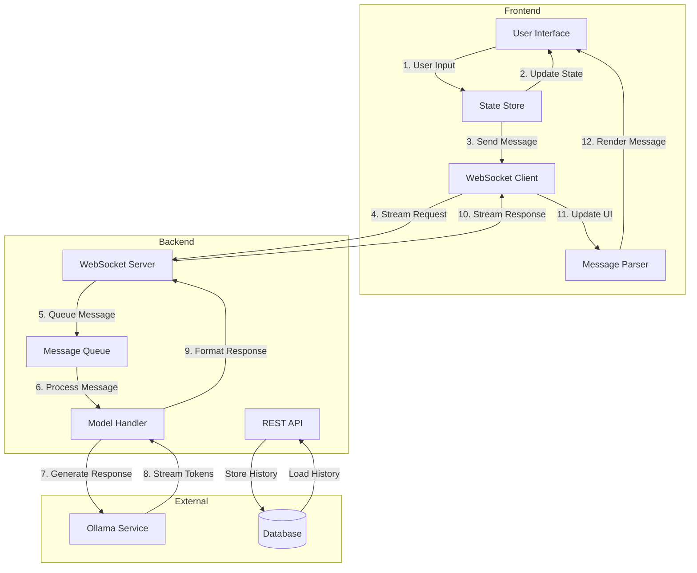
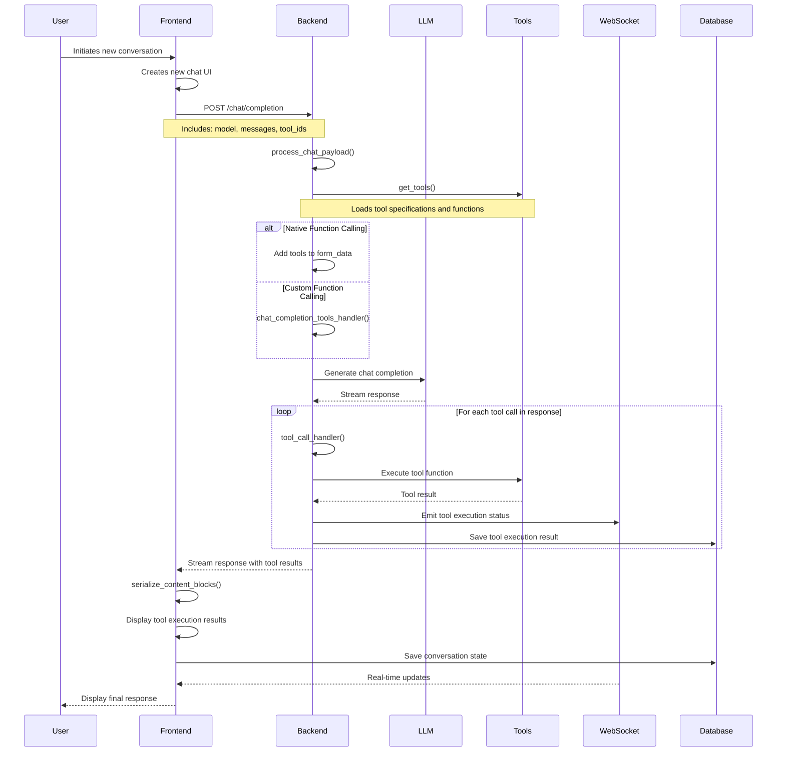

# Chat Workflow Documentation

## Overview

This document details the complete chat workflow in Open WebUI, covering both frontend and backend components, tools, and processes involved in handling chat interactions.

## High-Level Flow



## Frontend Components

### 1. Chat Interface Components

```typescript
interface ChatInterface {
	MessageList: React.FC<{
		messages: Message[];
		onEdit: (id: string, content: string) => void;
		onDelete: (id: string) => void;
	}>;

	InputArea: React.FC<{
		onSend: (content: string) => void;
		onAttach: (file: File) => void;
		isTyping: boolean;
	}>;

	MessageItem: React.FC<{
		content: string;
		type: 'user' | 'assistant';
		timestamp: Date;
		status: 'sending' | 'sent' | 'error';
	}>;
}
```

### 2. State Management

```typescript
interface ChatState {
	messages: Message[];
	currentChat: {
		id: string;
		title: string;
		model: string;
		context: string[];
	};
	status: {
		isTyping: boolean;
		isConnected: boolean;
		error: Error | null;
	};
}

interface Message {
	id: string;
	content: string;
	role: 'user' | 'assistant' | 'system';
	timestamp: Date;
	metadata: {
		modelId: string;
		tokens: number;
		processingTime: number;
	};
}
```

### 3. WebSocket Client

```typescript
class ChatWebSocket {
	private ws: WebSocket;
	private messageQueue: Queue<Message>;

	connect(): void;
	disconnect(): void;
	send(message: Message): void;

	onMessage(callback: (data: MessageEvent) => void): void;
	onError(callback: (error: Error) => void): void;
	onReconnect(callback: () => void): void;
}
```

## Backend Components

### 1. API Endpoints

```typescript
// REST Endpoints
interface ChatAPI {
  // Create new chat session
  POST '/api/chat/create': {
    body: {
      model: string;
      title?: string;
      systemPrompt?: string;
    };
    response: {
      chatId: string;
      title: string;
    };
  };

  // Send message
  POST '/api/chat/send': {
    body: {
      chatId: string;
      content: string;
      attachments?: File[];
    };
    response: {
      messageId: string;
      status: 'accepted';
    };
  };

  // Get chat history
  GET '/api/chat/:chatId/history': {
    response: {
      messages: Message[];
      metadata: ChatMetadata;
    };
  };
}
```

### 2. WebSocket Handler

```typescript
interface WebSocketHandler {
	// Message streaming
	handleStream(ws: WebSocket, message: Message): void;

	// Events
	onClientConnect(ws: WebSocket): void;
	onClientDisconnect(ws: WebSocket): void;
	onError(ws: WebSocket, error: Error): void;

	// Message processing
	processMessage(message: Message): AsyncGenerator<Token>;
	formatResponse(tokens: Token[]): Message;
}
```

### 3. Message Queue

```typescript
interface MessageQueue {
	// Queue operations
	enqueue(message: Message): void;
	dequeue(): Message;

	// Priority handling
	setPriority(messageId: string, priority: number): void;

	// Rate limiting
	getRateLimit(userId: string): number;
	updateRateLimit(userId: string): void;
}
```

## Tools and Utilities

### 1. Message Processing Tools

```typescript
interface MessageTools {
	// Content processing
	parseMarkdown(content: string): HTMLElement;
	highlightCode(code: string, language: string): string;
	sanitizeHTML(html: string): string;

	// File handling
	processAttachments(files: File[]): Promise<Attachment[]>;
	extractCodeBlocks(message: string): CodeBlock[];
}
```

### 2. Context Management

```typescript
interface ContextManager {
	// Context operations
	getContext(chatId: string): string[];
	updateContext(chatId: string, messages: Message[]): void;
	pruneContext(context: string[], maxTokens: number): string[];

	// Memory management
	calculateTokens(text: string): number;
	optimizeMemoryUsage(chat: Chat): void;
}
```

### 3. Error Handling

```typescript
interface ErrorHandler {
	// Error types
	NetworkError: typeof Error;
	ModelError: typeof Error;
	RateLimitError: typeof Error;

	// Error handling
	handleWSError(error: Error): void;
	handleAPIError(error: Error): void;
	handleModelError(error: Error): void;

	// Recovery
	reconnectWS(): Promise<void>;
	retryMessage(message: Message): Promise<void>;
}
```

## Complete Message Lifecycle

1. **User Input Processing**

   ```typescript
   interface InputProcessor {
   	validateInput(content: string): boolean;
   	preprocessMessage(content: string): string;
   	handleSpecialCommands(content: string): Command | null;
   }
   ```

2. **Message Transmission**

   ```typescript
   interface MessageTransmitter {
   	prepareForTransmission(message: Message): TransmissionPacket;
   	sendMessage(packet: TransmissionPacket): Promise<void>;
   	confirmDelivery(messageId: string): void;
   }
   ```

3. **Model Interaction**

   ```typescript
   interface ModelInteraction {
   	preparePrompt(message: Message, context: string[]): Prompt;
   	streamResponse(prompt: Prompt): AsyncGenerator<Token>;
   	handleModelOutput(output: AsyncGenerator<Token>): Promise<Message>;
   }
   ```

4. **Response Processing**
   ```typescript
   interface ResponseProcessor {
   	processStreamingResponse(stream: AsyncGenerator<Token>): Message;
   	formatResponse(response: Message): FormattedMessage;
   	updateUIWithResponse(message: FormattedMessage): void;
   }
   ```

## Database Schema

```sql
-- Chat Sessions
CREATE TABLE chat_sessions (
    id TEXT PRIMARY KEY,
    title TEXT,
    model_id TEXT,
    created_at TIMESTAMP,
    updated_at TIMESTAMP,
    system_prompt TEXT,
    metadata JSONB
);

-- Messages
CREATE TABLE messages (
    id TEXT PRIMARY KEY,
    chat_id TEXT REFERENCES chat_sessions(id),
    role TEXT,
    content TEXT,
    created_at TIMESTAMP,
    metadata JSONB,
    tokens INTEGER,
    processing_time INTEGER
);

-- Attachments
CREATE TABLE attachments (
    id TEXT PRIMARY KEY,
    message_id TEXT REFERENCES messages(id),
    type TEXT,
    url TEXT,
    created_at TIMESTAMP
);
```

## Performance Optimizations

1. **Frontend Optimizations**

   - Message virtualization for long conversations
   - Incremental rendering for streaming responses
   - Debounced input handling
   - Memoized message components

2. **Backend Optimizations**

   - Connection pooling for database
   - Message queue optimization
   - Caching frequently used contexts
   - Rate limiting and request throttling

3. **Network Optimizations**
   - WebSocket heartbeat mechanism
   - Compressed message transmission
   - Binary message format
   - Connection recovery strategies

## Error Recovery Strategies

1. **Connection Issues**

   - Automatic WebSocket reconnection
   - Message queue persistence
   - State recovery after reconnection
   - Offline message queueing

2. **Model Errors**

   - Fallback model selection
   - Automatic retry with backoff
   - Partial response recovery
   - Context pruning on failures

3. **Data Consistency**
   - Message deduplication
   - State synchronization
   - Transaction rollback handling
   - Conflict resolution strategies

## Tool Calls Workflow

The following diagram illustrates the complete flow when a user initiates a new conversation with tool calls:



### Key Components

1. **Frontend (Chat.svelte)**:

   - Handles user input
   - Manages chat UI state
   - Creates message pairs
   - Handles WebSocket connections
   - Displays tool execution results

2. **Backend (middleware.py)**:

   - `process_chat_payload`: Main entry point for processing chat requests
   - `chat_completion_tools_handler`: Handles tool execution
   - `process_chat_response`: Processes streaming responses
   - Manages WebSocket events

3. **Tools System**:

   - Tool specifications loaded from configuration
   - Tool functions executed in response to LLM requests
   - Results formatted and returned to chat

4. **WebSocket Events**:

   - Real-time updates on tool execution status
   - Progress notifications
   - Error handling

5. **Database Operations**:
   - Saves chat history
   - Stores tool execution results
   - Maintains conversation state

### Process Flow

The system follows these steps:

1. Processes user input
2. Loads appropriate tools
3. Generates responses with the LLM
4. Executes tools when called
5. Streams results back to the user
6. Maintains state and history

This architecture enables:

- Real-time tool execution feedback
- Asynchronous processing
- State persistence
- Error handling
- Extensibility through the tool system
