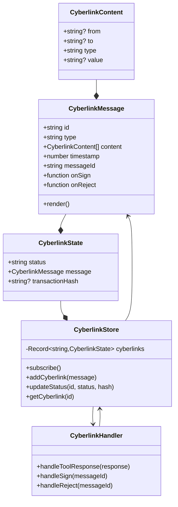
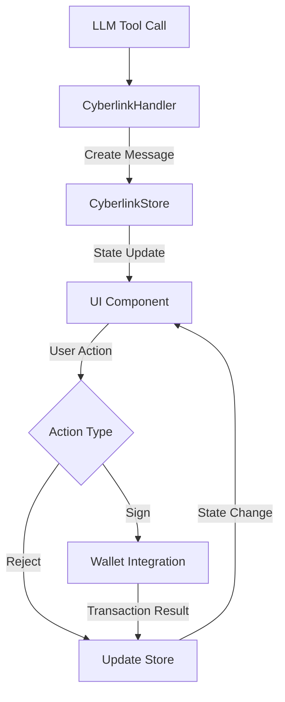
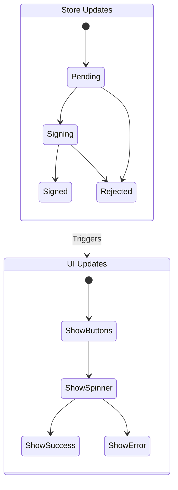

# Cyberlink Component Architecture

## Component Diagram



## Data Flow



## Component Responsibilities

### Data Layer

- **CyberlinkContent**: Base data structure for links
- **CyberlinkMessage**: Message wrapper with metadata
- **CyberlinkState**: Transaction state container

### State Management

- **CyberlinkStore**: Central state manager
  - Maintains transaction records
  - Provides reactive state updates
  - Handles state persistence

### Business Logic

- **CyberlinkHandler**: Transaction processor
  - Processes LLM responses
  - Manages transaction lifecycle
  - Coordinates with wallet

### UI Layer

- **CyberlinkMessage Component**: User interface
  - Displays transaction details
  - Handles user interactions
  - Shows transaction status

## Communication Flow

1. **LLM to Handler**

   ```typescript
   // Tool response processing
   handler.handleToolResponse(toolResponse);
   ```

2. **Handler to Store**

   ```typescript
   // State updates
   store.addCyberlink(message);
   store.updateStatus(id, status);
   ```

3. **Store to UI**

   ```typescript
   // Reactive updates
   $: cyberlink = $cyberlinkStore[messageId];
   ```

4. **UI to Handler**
   ```typescript
   // User actions
   onSign(messageId);
   onReject(messageId);
   ```

## State Updates



This architecture ensures:

- Clear separation of concerns
- Type-safe data flow
- Reactive UI updates
- Consistent state management
- Error boundary containment
