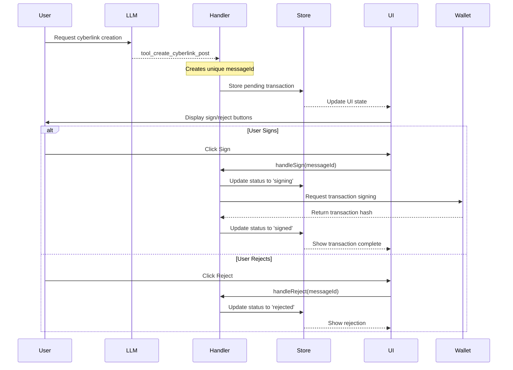
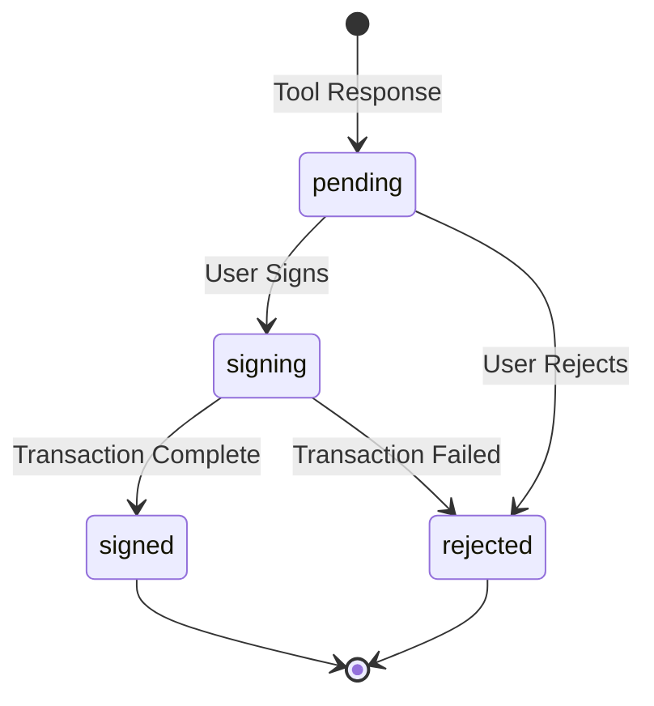

# Cyberlink Transaction Workflow

## Overview

This document describes the complete workflow for handling cyberlink transactions from LLM tool calls through to user interaction and blockchain transaction completion.



## Components

### 1. Types (`app/types/cyberlink.ts`)

Core type definitions for the cyberlink system:

- `CyberlinkContent`: Individual cyberlink data structure
- `CyberlinkMessage`: Message container with type and content
- `CyberlinkState`: Transaction state management
- `CyberlinkToolResponse`: LLM tool response structure

```typescript
interface CyberlinkContent {
	from?: string;
	to?: string;
	type: string;
	value?: string;
}

interface CyberlinkMessage {
	id: string;
	type: 'single' | 'multiple';
	content: CyberlinkContent[];
	timestamp: number;
}

interface CyberlinkState {
	status: 'pending' | 'signing' | 'signed' | 'rejected';
	message: CyberlinkMessage;
	transactionHash?: string;
}
```

### 2. Store (`app/stores/cyberlinkStore.ts`)

Svelte store managing the state of all cyberlink transactions:

- Maintains a record of all cyberlink states
- Provides methods for adding and updating cyberlinks
- Handles reactive updates to the UI

### 3. Handler (`app/lib/cyberlinkHandler.ts`)

Business logic for processing cyberlink operations:

- Processes LLM tool responses
- Generates unique message IDs
- Manages transaction signing flow
- Handles error cases

### 4. UI Component (`app/components/CyberlinkMessage.svelte`)

Svelte component for displaying cyberlink messages:

- Renders transaction details
- Provides sign/reject buttons
- Shows transaction status
- Displays transaction hash when complete

## Workflow Steps

1. **Initial Tool Call**

   - User interacts with LLM
   - LLM triggers `tool_create_cyberlink_post`
   - Handler receives tool response

2. **Message Creation**

   - Handler generates unique messageId
   - Creates CyberlinkMessage object
   - Stores initial pending state

3. **UI Presentation**

   - Component subscribes to store
   - Renders message content
   - Shows action buttons

4. **User Action**

   - User chooses to sign or reject
   - UI triggers appropriate handler method
   - Store updates transaction status

5. **Transaction Processing**
   - If signed:
     - Status updates to 'signing'
     - Wallet interaction occurs
     - Transaction hash stored
     - Status updates to 'signed'
   - If rejected:
     - Status updates to 'rejected'
     - No blockchain interaction

## State Machine



## Error Handling

The system handles various error cases:

- Invalid tool responses
- Failed transactions
- Wallet interaction errors
- Missing or invalid data

Each error case updates the UI appropriately and maintains a consistent state.

## Integration Points

1. **LLM Tool Integration**

   ```typescript
   const handler = new CyberlinkHandler();
   const messageId = handler.handleToolResponse(toolResponse);
   ```

2. **Wallet Integration**

   ```typescript
   // In CyberlinkHandler
   async handleSign(messageId: string) {
     try {
       // Wallet interaction here
       const txHash = await wallet.signAndBroadcast(...);
       this.updateStatus(messageId, 'signed', txHash);
     } catch (error) {
       this.updateStatus(messageId, 'rejected');
     }
   }
   ```

3. **UI Integration**
   ```svelte
   <CyberlinkMessage {messageId} onSign={handleSign} onReject={handleReject} />
   ```

## Best Practices

1. Always maintain transaction state in the store
2. Handle all error cases gracefully
3. Provide clear feedback to users
4. Keep the UI responsive during transactions
5. Maintain proper type safety throughout
6. Log important events for debugging
