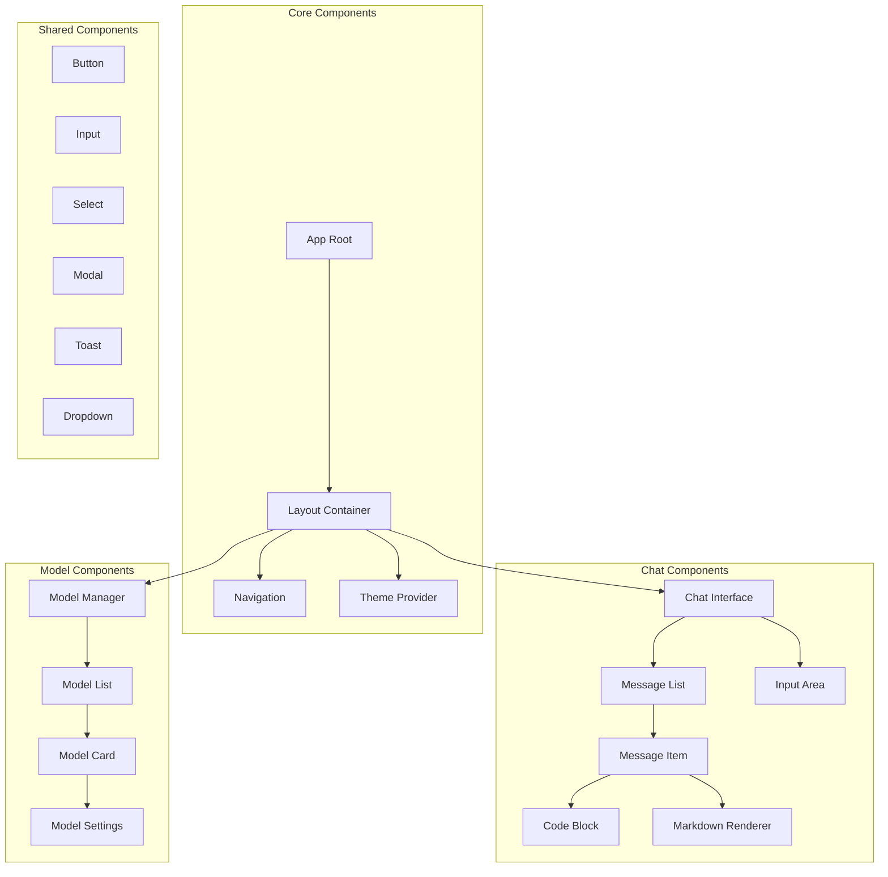
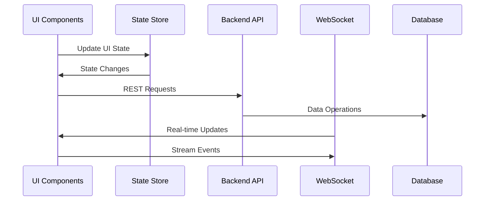

# Frontend Component Schema and Backend Connections

## Component Architecture



## Component Details

### Core Components

1. **App Root (`app/App.tsx`)**

   - Main application container
   - Global state initialization
   - Route configuration
   - Theme context provider

2. **Layout Container (`components/Layout/`)**

   - Page structure
   - Sidebar toggle
   - Main content area
   - Responsive layout management

3. **Navigation (`components/Nav/`)**
   - Main navigation menu
   - Model selection
   - Settings access
   - User preferences

### Chat Components

1. **Chat Interface (`components/Chat/`)**

   - Chat session management
   - Message threading
   - Real-time updates
   - Context handling

2. **Message Components**

   - Message rendering
   - Code highlighting
   - Markdown support
   - Message actions (copy, edit, delete)

3. **Input Area**
   - Message composition
   - File attachments
   - Send controls
   - Typing indicators

### Model Components

1. **Model Manager**

   - Model list display
   - Model installation
   - Version management
   - Configuration interface

2. **Model Settings**
   - Parameter configuration
   - Temperature control
   - Context length
   - System prompts

## Backend Connection Points

### REST API Endpoints

1. **Chat Endpoints**

```typescript
POST / api / chat / send;
GET / api / chat / history;
DELETE / api / chat / clear;
PATCH / api / chat / message;
```

2. **Model Endpoints**

```typescript
GET / api / models / list;
POST / api / models / install;
DELETE / api / models / remove;
PATCH / api / models / update;
```

3. **Settings Endpoints**

```typescript
GET / api / settings;
PATCH / api / settings / update;
```

### WebSocket Connections

1. **Chat Stream**

```typescript
ws://host/api/chat/stream
- Events:
  - message
  - error
  - typing
  - complete
```

2. **Model Status**

```typescript
ws://host/api/models/status
- Events:
  - download_progress
  - installation_status
  - error
```

## State Management

### Global State

```typescript
interface GlobalState {
	currentModel: ModelConfig;
	chatHistory: Message[];
	settings: UserSettings;
	theme: ThemeConfig;
	connection: ConnectionStatus;
}
```

### Component State

```typescript
interface ChatState {
	messages: Message[];
	isTyping: boolean;
	context: string[];
	error: Error | null;
}

interface ModelState {
	installed: Model[];
	downloading: DownloadStatus[];
	active: string | null;
}
```

## Data Flow



## Error Handling

1. **Frontend Error Boundaries**

   - Component-level error catching
   - Fallback UI components
   - Error reporting

2. **API Error Handling**

   - HTTP status codes
   - Error response format
   - Retry mechanisms

3. **WebSocket Error Recovery**
   - Connection retry
   - State synchronization
   - Fallback to REST API

## Component Styling

1. **Theme System**

   - Dark/Light modes
   - Custom color schemes
   - Component-specific themes

2. **Responsive Design**

   - Mobile-first approach
   - Breakpoint system
   - Flexible layouts

3. **Animation**
   - Transition effects
   - Loading states
   - Interaction feedback

## Performance Considerations

1. **Component Optimization**

   - Lazy loading
   - Code splitting
   - Memoization

2. **Data Management**

   - Caching strategy
   - Pagination
   - Virtual scrolling

3. **Network Optimization**
   - Request batching
   - Data compression
   - Connection pooling
