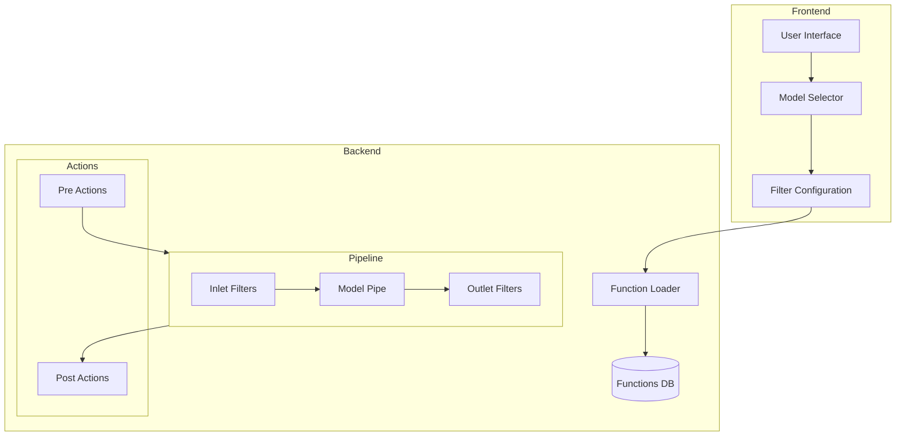
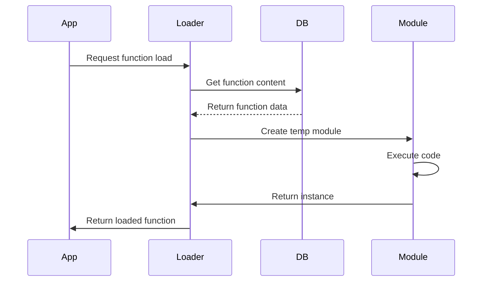
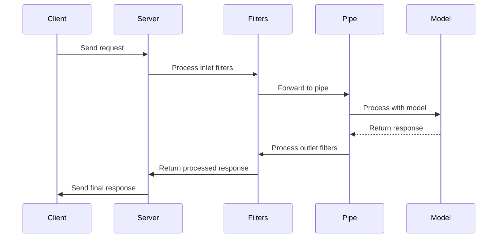

# Functions System Documentation

## Overview

The Functions system in Open WebUI is a powerful and flexible architecture that enables dynamic processing pipelines, middleware operations, and custom actions. It consists of three main components: Pipes, Filters, and Actions.

## Core Components

### 1. Functions Base System

Functions are stored and managed through a database system, with the following key characteristics:

```typescript
interface Function {
	id: string;
	name: string;
	type: 'pipe' | 'filter' | 'action';
	content: string;
	is_active: boolean;
	is_global: boolean;
	valves: Record<string, any>; // Configuration parameters
	created_at: Date;
	updated_at: Date;
}
```

### 2. Pipes

Pipes are the primary components responsible for model interactions and data processing. They can be either single pipes (handling direct model interactions) or manifold pipes (containing multiple sub-pipes for routing).

```python
class Pipe:
    class Valves(BaseModel):
        # Configuration parameters
        OPENAI_API_BASE_URL: str = "https://api.openai.com/v1"
        OPENAI_API_KEY: str = "your-key"

    def __init__(self):
        self.type = "pipe"  # or "manifold" for multi-model pipes
        self.valves = self.Valves()
        self.pipes = self.get_openai_models()  # For manifold pipes only

    def pipe(self, body: dict) -> Union[str, Generator, Iterator]:
        # Main processing logic
        pass
```

#### Pipe Initialization and Loading

1. **Dynamic Loading**: Pipes are loaded dynamically using the `load_function_module_by_id` function:

```python
def load_function_module_by_id(function_id):
    # Creates module instance
    module = types.ModuleType(f"function_{function_id}")
    # Executes pipe code and returns instance
    if hasattr(module, "Pipe"):
        return module.Pipe(), "pipe", frontmatter
```

2. **Execution Flow**: Pipes are executed through `generate_function_chat_completion`:

```python
async def execute_pipe(pipe, params):
    if inspect.iscoroutinefunction(pipe):
        return await pipe(**params)
    else:
        return pipe(**params)
```

#### Pipeline Processing Sequence

1. Client sends request
2. Server processes inlet filters
3. Pipe handles request
4. Model processes request
5. Pipe receives response
6. Server processes outlet filters
7. Client receives final response

#### Types of Pipes:

1. **Single Pipes**

   - Handle direct model interactions
   - Process single requests/responses
   - Used for straightforward model integrations

2. **Manifold Pipes**
   - Contain multiple sub-pipes
   - Can route requests to different models
   - Support dynamic model selection
   - Used for complex routing scenarios

#### Integration Points

Pipes integrate with multiple system components:

1. **Chat System Integration**

   - Handles message processing
   - Manages conversation flow
   - Processes model responses

2. **Model Management**

   - Configures model parameters
   - Handles model selection
   - Manages model routing

3. **Filter System**

   - Pre-processes requests (inlet)
   - Post-processes responses (outlet)
   - Modifies data flow

4. **Action System**
   - Triggers custom operations
   - Handles side effects
   - Manages workflow events

### 3. Filters

Filters act as middleware components that can modify requests and responses in the processing pipeline.

```python
class Filter:
    class Valves(BaseModel):
        priority: int = 0  # Execution order priority
        max_turns: int = 8  # Example configuration

    def __init__(self):
        self.type = "filter"
        self.valves = self.Valves()
        self.is_global = True  # Whether filter applies globally

    def inlet(self, body: dict) -> dict:
        # Pre-processing hook
        return body

    def outlet(self, body: dict) -> dict:
        # Post-processing hook
        return body
```

### 4. Actions

Actions are custom operations that can be triggered at specific points in the workflow.

```python
class Action:
    class Valves(BaseModel):
        enabled: bool = True
        config: dict = {}

    def __init__(self):
        self.type = "action"
        self.valves = self.Valves()

    def execute(self, context: dict) -> dict:
        # Action execution logic
        pass
```

## System Architecture



## Function Loading and Execution

### Loading Process



### Execution Flow



## Integration Points

### 1. Chat System Integration

The functions system integrates with the chat workflow at multiple points:

1. **Pre-processing**: Inlet filters modify incoming messages
2. **Model Selection**: Pipes handle model routing and processing
3. **Post-processing**: Outlet filters modify model responses
4. **Actions**: Can be triggered at various points in the chat flow

### 2. Model Management Integration

Functions are integrated with model management through:

1. **Model Configuration**: Pipe valves configure model parameters
2. **Filter Assignment**: Models can have specific filters assigned
3. **Global Filters**: Apply to all models unless explicitly disabled

### 3. UI Integration

The frontend provides interfaces for:

1. **Function Management**: Create, edit, and delete functions
2. **Valve Configuration**: Configure function parameters
3. **Filter Assignment**: Assign filters to specific models
4. **Action Triggers**: Configure action trigger points

## Configuration and Management

### 1. Valve Configuration

Valves provide configuration parameters for functions:

```typescript
interface ValveConfiguration {
	// Common valve properties
	enabled: boolean;
	priority: number;

	// Function-specific configuration
	parameters: Record<string, any>;

	// User-specific overrides
	userOverrides: Record<string, any>;
}
```

### 2. Priority Management

Filters are executed in priority order:

```python
def get_sorted_filter_ids(model: dict):
    def get_priority(function_id):
        function = Functions.get_function_by_id(function_id)
        if function is not None:
            valves = Functions.get_function_valves_by_id(function_id)
            return valves.get("priority", 0) if valves else 0
        return 0

    filter_ids = [function.id for function in Functions.get_global_filter_functions()]
    filter_ids.sort(key=get_priority)
    return filter_ids
```

### 3. Global vs Model-Specific Functions

Functions can be:

- **Global**: Apply to all models
- **Model-Specific**: Only apply to designated models
- **Conditional**: Apply based on runtime conditions

## Development Guidelines

### 1. Creating New Functions

1. **Choose Function Type**:

   - Pipe: For model interactions
   - Filter: For request/response modification
   - Action: For custom operations

2. **Define Valves**:

   - Configuration parameters
   - Default values
   - Validation rules

3. **Implement Core Logic**:
   - Follow type-specific interfaces
   - Handle errors appropriately
   - Document behavior

### 2. Best Practices

1. **Error Handling**:

   - Graceful error recovery
   - Meaningful error messages
   - Error propagation

2. **Performance**:

   - Minimize processing overhead
   - Efficient resource usage
   - Proper cleanup

3. **Security**:
   - Input validation
   - Safe configuration handling
   - Resource access control

## Security Considerations

### 1. Function Isolation

Functions are loaded in isolated modules to prevent:

- Global state pollution
- Unintended side effects
- Resource conflicts

### 2. Access Control

Functions implement access control through:

- User permissions
- Resource limitations
- Configuration validation

### 3. Resource Management

The system manages resources through:

- Memory limits
- Execution timeouts
- Rate limiting

## Monitoring and Debugging

### 1. Logging

Functions support comprehensive logging:

- Execution flow
- Error conditions
- Performance metrics

### 2. Metrics

The system tracks:

- Function execution times
- Error rates
- Resource usage

### 3. Debugging Tools

Tools available for debugging:

- Function state inspection
- Execution tracing
- Configuration validation
