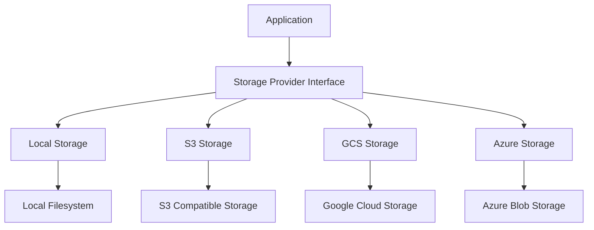

# Storage System Documentation

## Overview

The Open WebUI storage system provides a flexible and extensible storage solution that supports multiple storage providers including:

- Local filesystem storage
- Amazon S3 compatible storage
- Google Cloud Storage (GCS)
- Azure Blob Storage

The system uses an abstract provider interface that allows seamless switching between storage backends while maintaining consistent functionality.

## Architecture



## Storage Provider Interface

The storage system is built around an abstract `StorageProvider` base class that defines the core interface:

```python
class StorageProvider(ABC):
    @abstractmethod
    def get_file(self, file_path: str) -> str:
        pass

    @abstractmethod
    def upload_file(self, file: BinaryIO, filename: str) -> Tuple[bytes, str]:
        pass

    @abstractmethod
    def delete_all_files(self) -> None:
        pass

    @abstractmethod
    def delete_file(self, file_path: str) -> None:
        pass
```

## Storage Providers

### Local Storage Provider

The `LocalStorageProvider` implements basic file system operations:

- Files are stored in the configured `UPLOAD_DIR` directory
- Simple file operations using Python's built-in file handling
- Maintains local copies of files

### S3 Storage Provider

The `S3StorageProvider` implements AWS S3 compatible storage:

- Supports AWS S3 and S3-compatible services (MinIO, etc)
- Configurable via environment variables:
  - `S3_ACCESS_KEY_ID`
  - `S3_SECRET_ACCESS_KEY`
  - `S3_BUCKET_NAME`
  - `S3_ENDPOINT_URL`
  - `S3_REGION_NAME`
  - `S3_KEY_PREFIX`
- Supports acceleration endpoint and addressing style configuration
- Falls back to AWS credentials provider chain if no explicit credentials

### Google Cloud Storage Provider

The `GCSStorageProvider` implements Google Cloud Storage:

- Supports GCS authentication via:
  - Service account JSON credentials
  - Default application credentials
  - GCE metadata server
- Configurable via:
  - `GCS_BUCKET_NAME`
  - `GOOGLE_APPLICATION_CREDENTIALS_JSON`

### Azure Blob Storage Provider

The `AzureStorageProvider` implements Azure Blob Storage:

- Supports authentication via:
  - Storage account key
  - Azure Managed Identity
- Configurable via:
  - `AZURE_STORAGE_ENDPOINT`
  - `AZURE_STORAGE_CONTAINER_NAME`
  - `AZURE_STORAGE_KEY`

## Common Functionality

All storage providers implement:

1. File Upload

   - Accepts binary file input and filename
   - Returns file contents and storage path
   - Handles validation and error cases

2. File Retrieval

   - Downloads file from storage to local path
   - Returns local file path for access
   - Handles missing files and errors

3. File Deletion

   - Individual file deletion
   - Bulk deletion of all files
   - Cleanup of local copies

4. Error Handling
   - Provider-specific error handling
   - Consistent error reporting
   - Graceful fallbacks

## Usage

The storage system is initialized based on the `STORAGE_PROVIDER` configuration:

```python
storage = get_storage_provider(STORAGE_PROVIDER)
```

Basic operations:

```python
# Upload
contents, path = storage.upload_file(file_obj, "example.txt")

# Download
local_path = storage.get_file("s3://bucket/example.txt")

# Delete
storage.delete_file("example.txt")
```

## Best Practices

1. Always clean up local files after use
2. Handle provider-specific errors appropriately
3. Validate file contents before upload
4. Use environment variables for sensitive credentials
5. Implement proper error handling and logging
6. Consider implementing retry logic for cloud storage operations

## Configuration

The storage system is configured via environment variables:

```bash
# Storage Provider Selection
STORAGE_PROVIDER=s3|gcs|azure|local

# Local Storage
UPLOAD_DIR=/path/to/uploads

# S3 Configuration
S3_ACCESS_KEY_ID=xxx
S3_SECRET_ACCESS_KEY=xxx
S3_BUCKET_NAME=bucket
S3_ENDPOINT_URL=https://...
S3_REGION_NAME=region
S3_KEY_PREFIX=prefix/
S3_USE_ACCELERATE_ENDPOINT=true|false
S3_ADDRESSING_STYLE=path|virtual

# GCS Configuration
GCS_BUCKET_NAME=bucket
GOOGLE_APPLICATION_CREDENTIALS_JSON={"type": "service_account",...}

# Azure Configuration
AZURE_STORAGE_ENDPOINT=https://...
AZURE_STORAGE_CONTAINER_NAME=container
AZURE_STORAGE_KEY=key
```

## Error Handling

The storage system implements consistent error handling across providers:

- File not found errors
- Permission errors
- Network/connectivity issues
- Invalid credentials
- Storage quota exceeded
- Invalid file content

Each provider implements appropriate error translation to maintain consistent error reporting to the application layer.

## Testing

The storage system includes comprehensive tests:

- Provider initialization tests
- File operation tests
- Error handling tests
- Configuration validation
- Integration tests for each provider

Example test:

```python
def test_get_storage_provider():
    Storage = provider.get_storage_provider("local")
    assert isinstance(Storage, provider.LocalStorageProvider)

    Storage = provider.get_storage_provider("s3")
    assert isinstance(Storage, provider.S3StorageProvider)

    Storage = provider.get_storage_provider("gcs")
    assert isinstance(Storage, provider.GCSStorageProvider)

    Storage = provider.get_storage_provider("azure")
    assert isinstance(Storage, provider.AzureStorageProvider)

    with pytest.raises(RuntimeError):
        provider.get_storage_provider("invalid")
```

## Security Considerations

1. Credentials Management

   - Use environment variables for sensitive credentials
   - Support managed identities where available
   - Rotate access keys regularly
   - Implement least privilege access

2. File Validation

   - Validate file types and contents
   - Implement size limits
   - Scan for malware
   - Sanitize filenames

3. Access Control

   - Implement proper bucket/container policies
   - Use appropriate ACLs
   - Enable audit logging
   - Monitor access patterns

4. Data Protection
   - Enable encryption at rest
   - Use secure transport (HTTPS)
   - Implement backup strategies
   - Consider data residency requirements

## Future Improvements

1. Additional Provider Support

   - FTP/SFTP support
   - WebDAV support
   - Other cloud storage providers

2. Enhanced Features

   - File streaming support
   - Chunked upload/download
   - Better progress tracking
   - Concurrent operations

3. Performance Optimizations

   - Connection pooling
   - Caching layer
   - Bulk operations
   - Compression

4. Monitoring & Observability
   - Metrics collection
   - Performance monitoring
   - Usage tracking
   - Cost optimization
